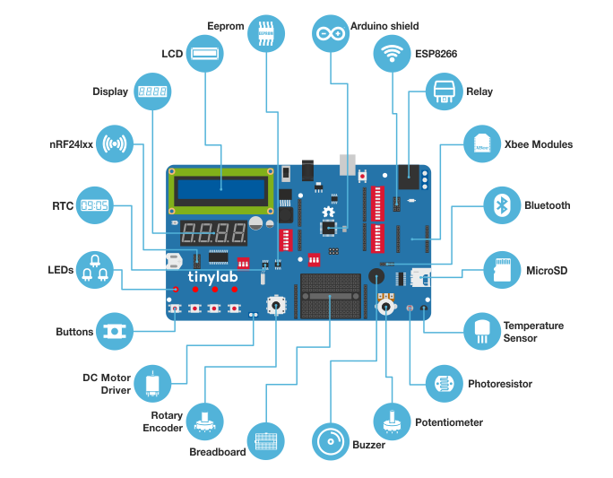

# tinylab-mblock-extension-documentation

TinyLab is an electronic board containing components frequently used in prototyping.Arduino is the basic element of the board  .In this way, you can use the items on the board with the arduino code.

