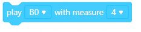

# Actuators

## Block : light the __ at __ intensity

This block used for setting led's intensity.With that block you can choose led and led's intensity. 

## Block : turned off the __

This block used for turned off the led. You can choose led that want to turn off.

## Block : relay__

This block used for turned on or turned off the relay. 

## Block : play __ with measure__

This block used for choose note and measure. You can choose note that want to use and also you can arrange  measure.

[Display ](https://github.com/Robotistan-Workspace/tinylab-mblock-extension-documentation/tree/main/doc/Display)