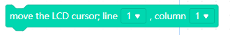

# Display

## LCD

### Block : setup the LCD

This block used for initialize LCD.

Note: You must use this block to start LCD.This block use with  "when TinyLab started" or "when clicked __ button" blocks.

### Block : move the LCD cursor;line __, column__

This block used for choose the line and column  that you want to write word.

Note: Don't forget to use "setup the LCD" block before using this block.

### Block : write __ to LCD

This block used for write word to LCD screen.

Note: Don't forget to use "setup the LCD" block before using this block.

### Block : clean the LCD

This block used for cleaning LCD screen. 

## 7-Segment

### Block : setup the 7-Segment

This block used for initialize 7-Segment.

Note:  You must use this block to start 7-Segment.This block use with  "when TinyLab started" or "when clicked __ button" blocks.

 

### Block : write __ to 7-Segment

This block used for write word to 7-Segment screen.

Note: Don't forget to use "setup the 7-Segment" block before using this block.

### Block : clean the 7-Segment

This block used for cleaning 7-Segment screen. 

[For Documentation](https://github.com/Robotistan-Workspace/tinylab-mblock-extension-documentation/tree/main/doc)