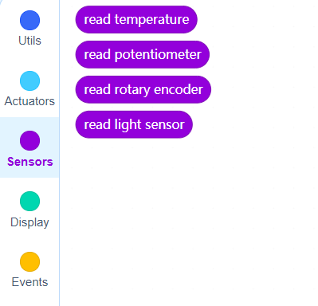

# Sensors

## Block: read temperature

This block read LM35 sensor and return the celcius degree that type is float.

## Block: read potentiometer 

This block read potentiometer's value. It can be between 0 to 1023.This block's type is integer.

## Block: read rotary encoder

 This block read encoder's value. It's contain positive and negative value.This block's type is integer.

 

 ## Block: read light sensor

 This block read ldr sensor.That type is float.

