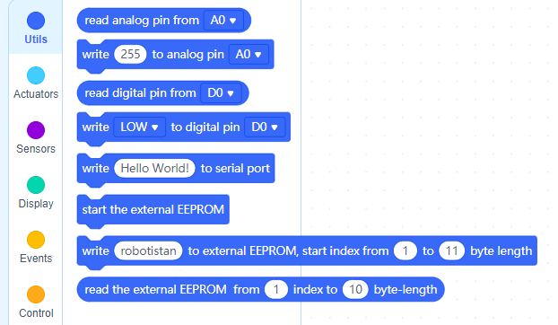
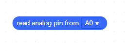
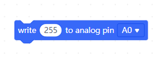

# Utils

## Block : read analog pin from __

This block reads the value from the specified analog pin.You can choose any of the analog pins you want.

## Block : write __ to analog pin __

This block write value  0 to 255 to analog pin which you want to use.

## Block : read digital pin from __

Reads the value from a specified digital pin.

## Block : write __ to digital pin __

Reads the value from a specified digital pin, you can select either "HIGH" or "LOW".

[For Documentation](https://github.com/Robotistan-Workspace/tinylab-mblock-extension-documentation/tree/main/doc)