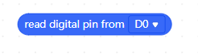

# Utils

## Block : read analog pin from __

This block reads the value from the specified analog pin.You can choose any of the analog pins you want.

## Block : write __ to analog pin __

This block write value  0 to 255 to analog pin which you want to use.

## Block : read digital pin from __

Reads the value from a specified digital pin.

## Block : write __ to digital pin __

You can write  "HIGH" or "LOW" to  the digital pin which you select.

## Block : write __ to serial port

 As a debugging tool, it can be used to test concepts or communicate directly with the Arduino board.

 

 ## Block : start the external EEPROM

This block used for initialize external EEPROM.

##  Block : write __ to external EEPROM, start index from __ to __ byte lenght 

This block is used to write to the external EEPROM. Write to the directory of your choice with this block

## Block : read the external EEPROM from __ index to __ byte-lenght

This block used for read the external EEPROM and you can start to write to which index you want and you can select byte length.

[For Documentation](https://github.com/Robotistan-Workspace/tinylab-mblock-extension-documentation/tree/main/doc)

**_________________________________________________________________________________________________________________________________________________**

# Araçlar

## Blok : __ analog pin değerini oku

Bu blok seçilen analog pinden değeri okur. Analog pinlerden istediğinizi seçebilirsiniz.

## Blok : __ analog pinine __ değerini yaz

Bu blok, kullanmak istediğiniz analog pine 0 ile 255 arası bir değer yazar.

## Blok : __ digital pinini oku

Bu blok seçilen digital pinden değeri okur. Digital pinlerden istediğinizi seçebilirsiniz.

## Blok : __ değerini __ digital pinine yaz

Seçilen digital pine "Yüksek" veya "Düşük" değerini yazar.

## Blok : seri porta __ değerini yaz

Bir hata ayıklama aracı olarak, kavramları test etmek veya doğrudan Arduino kartıyla iletişim kurmak için kullanılabilir. Seri porta istenlen ifadeyi yazar.

## Blok : harici EEPROM'u başlat

Bu blok harici EEPROM'u başlatır.

## Blok : __ ifadesini __ indisinden başlayarak __ bayt uzunluğunda harici EEPROM'a yaz

Bu blok ile istenilen ifade seçilen indisten başlayarak belirlenen bayt uzunluğunda harici EEPROM'a yazılır.

## Blok : harici EEPROM'dan __ indisinden başlayarak __ bayt uzunluğunda ifadeyi oku

Bu blok harici EEPROM'dan istenilen indisten başlayarak seçilen bayt uznluğunda okuma yapar.

[Belgeler İçin](https://github.com/Robotistan-Workspace/tinylab-mblock-extension-documentation/tree/main/doc)
