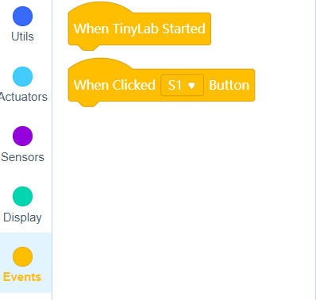
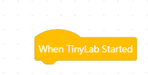
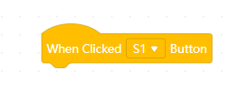

# Events

## When Tinylab Started

The blocks that at under the this block, running once when tinylab started.

## When Clicked __ Button

The blocks that at under the this block, running once when clicked the button.

[Utils ](https://github.com/Robotistan-Workspace/tinylab-mblock-extension-documentation/tree/main/doc/Utils)
