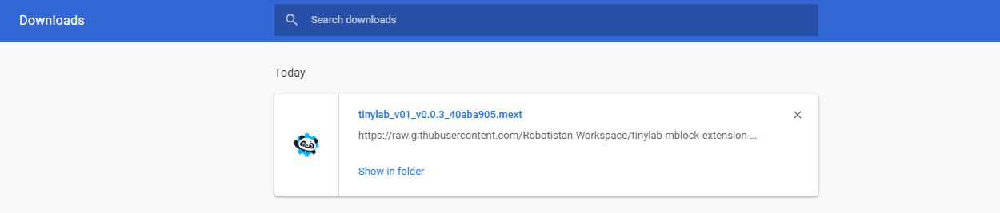
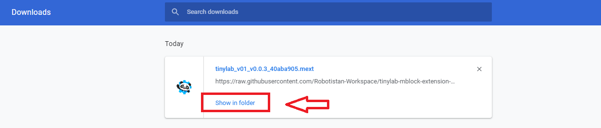
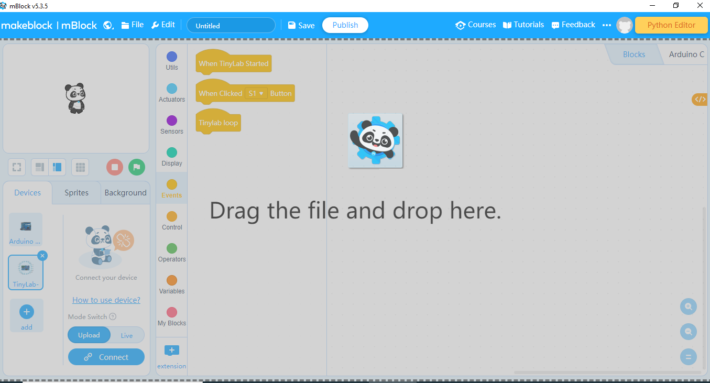

# how to download extension

You can download the extension from attached link:

[Download  link](./tinylab_v01_v0.0.3_40aba905.mext)

After that, you must go to downloads.

Then, you must select "show in folder".

Drag the file and drop the screen.

