# How to download extension

## Download at Github

You can download the extension from attached link:

[Download  link](./Tinylab_Mblock_Extension.mext)

After that, you must go to downloads.

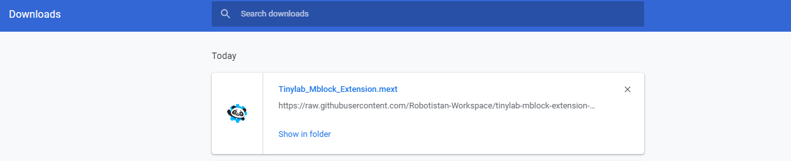

Then, you must select "show in folder".

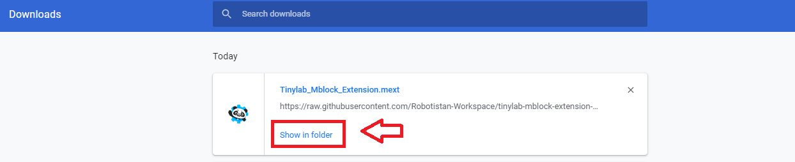

Drag the file and drop the screen.

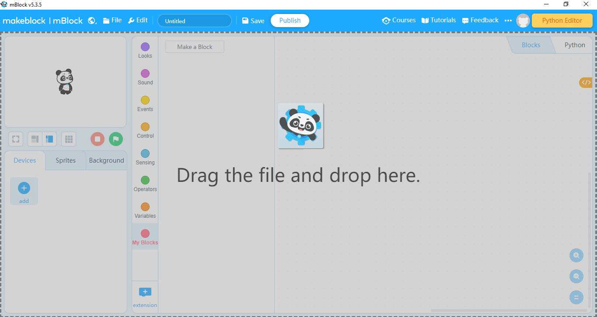

## Download at Mblock
 In Mblock's screen select the  "add" part.

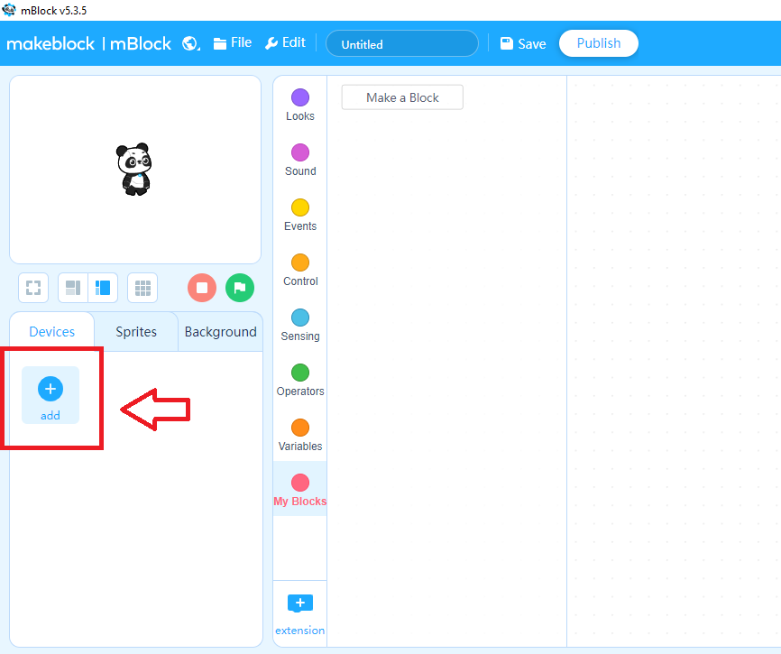

Select the "TinyLab" extension.

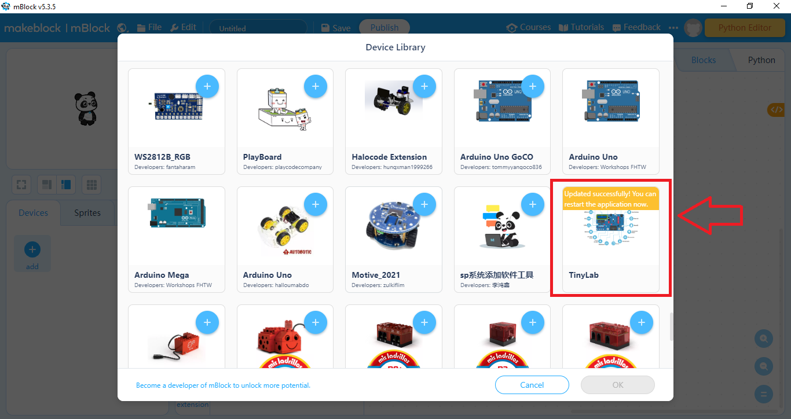

Select "ok".

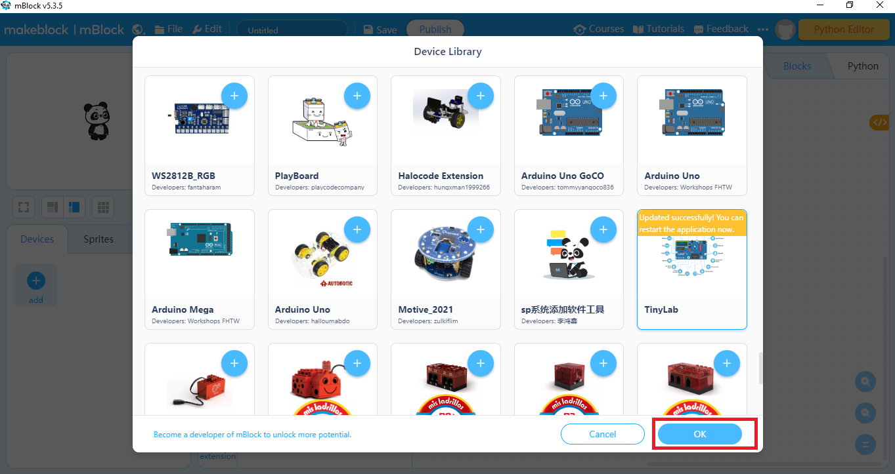

Then, you can use the TinyLab extension.

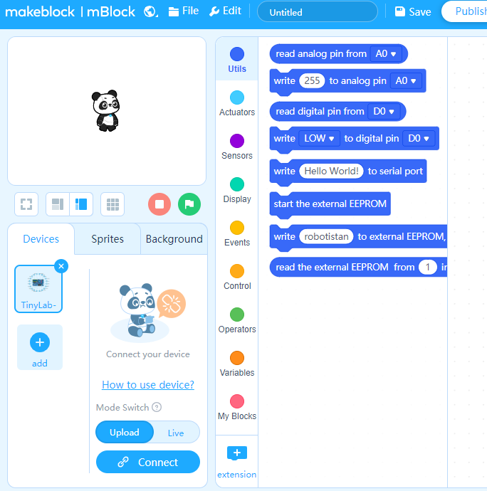

[For More Information](https://github.com/Robotistan-Workspace/tinylab-mblock-extension-documentation/tree/main/doc)

**_______________________________________________________________________________**

# Uzantı nasıl indirilir

## Github'tan indirme

Aşağıda verilen  linkten uzantıyı indirebilirsiniz.

[İndirme  linki](./Tinylab_Mblock_Extension.mext)

İndirdikten sonra, indirilenlere git.

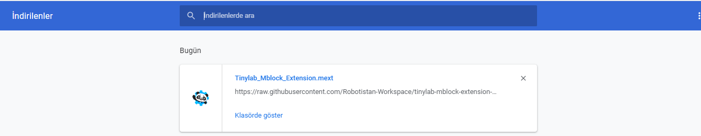

Sonrasında, "klasörde göster"i seçin.

Klasörü sürükleyip ekrana bırakın.

 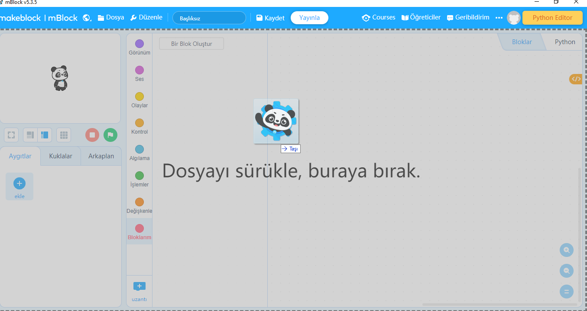

 ## Mblock'tan indirme

 Mblock ekranında "ekle" butonunu seçin.

 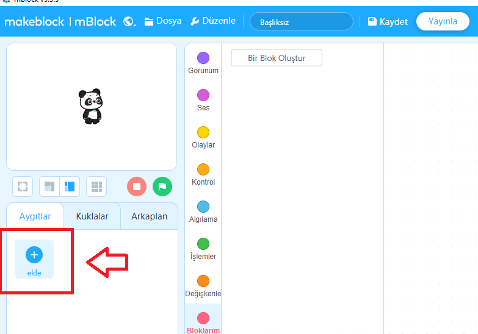

"TinyLab" uzantısını seçin.

 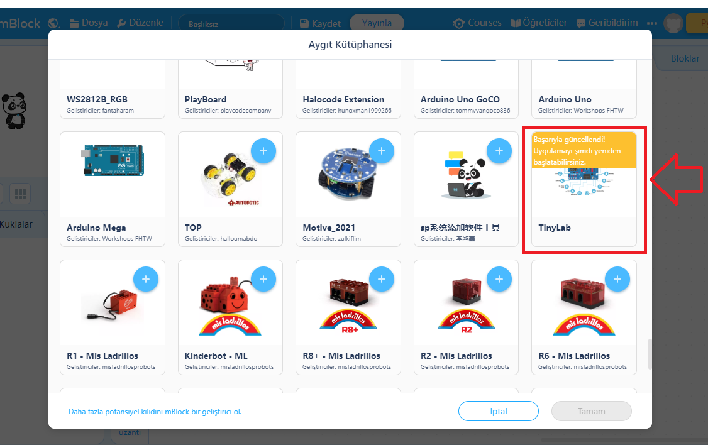

 "Tamam" seçin.

 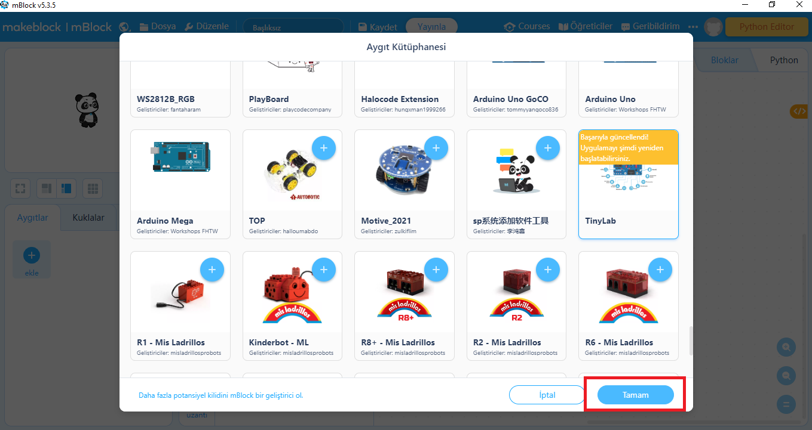

Artık TinyLab uzantısını kullanabilirsiniz.

  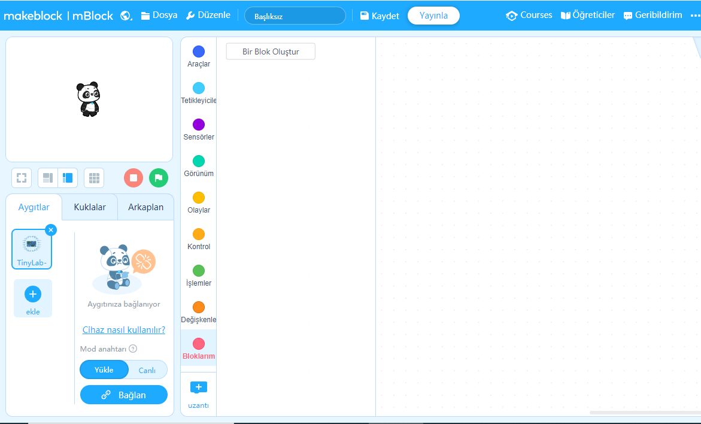

[Daha Fazla Bilgi İçin](https://github.com/Robotistan-Workspace/tinylab-mblock-extension-documentation/tree/main/doc)

